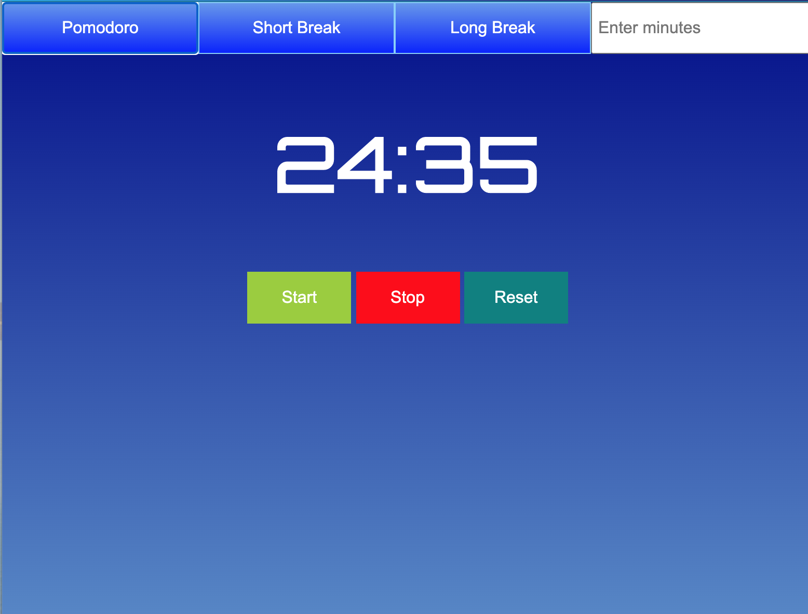

#Javascript Pomodoro Timer

<h3>Screenshots</h3>

<h3>About This Project</h3>

Simple Javascript pomodoro timer. You can start, stop, and pause the timer. Set times include 25 minute timer, short 5 min break, long 15 min break, and the option for user to input their own custom time.

Live version <a href="https://mickywagner.github.io/pomodoro-timer/">here</a>.

<h3>Technical Sheet</h3>

<ul>
  <li>HTML 5</li>
  <li>CSS 3</li>
  <li>Javascript ES6</li>
</ul>

